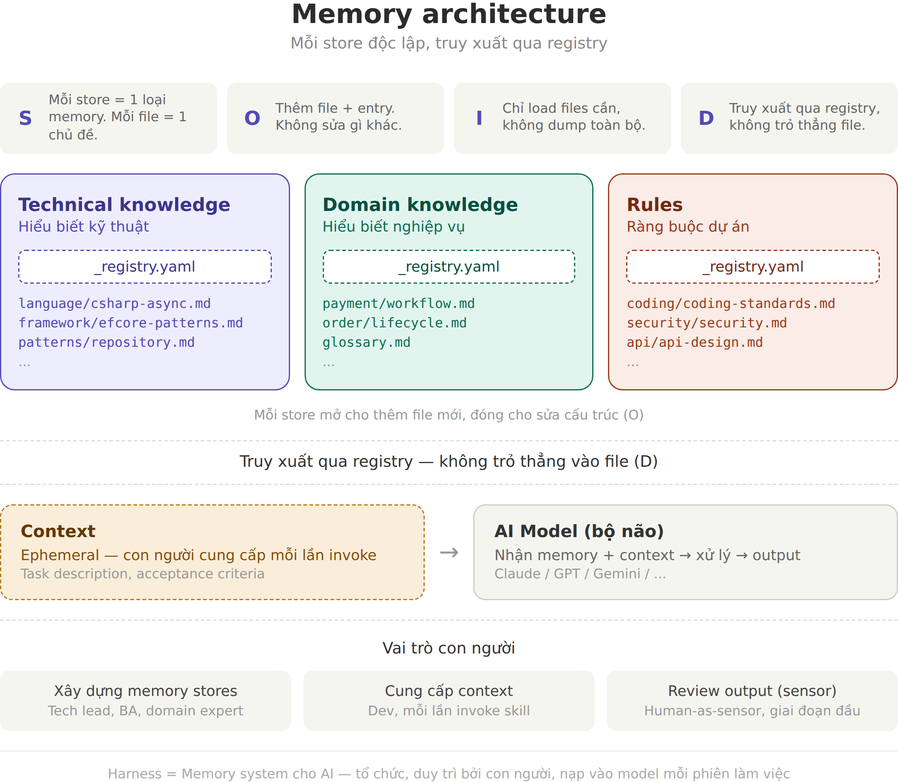
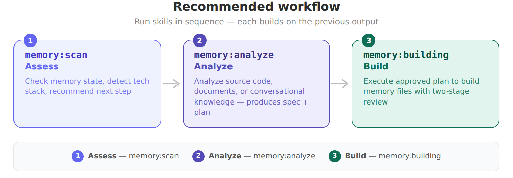

# Harness Engineering

## Overview

**Harness Engineering** is a methodology for using AI effectively in software development workflows, built on **Harness Principles**.

The core idea: an AI Model is like an exceptionally skilled developer who loses all memory at the end of every session. This methodology provides a structured system for organizing, maintaining, and reloading exactly the right "memory" — so the AI behaves consistently, accurately, and in compliance with project constraints across every working session.

### Memory Architecture



### Harness Engineering includes:

- **Memory Architecture** — An external knowledge storage system organized into 3 stores: Technical, Domain, and Rules
- **Registry-based Retrieval** — A smart memory retrieval mechanism via registry, loading only what is needed
- **SOLID Principles for Memory** — Applying SOLID principles to the organization and management of memory
- **Memory Toolkit Skills** — AI-powered skills that automate memory creation through scanning, analysis, and building
- **Guidelines** — A comprehensive set of documents detailing how to practice the methodology

## Quick Start

```bash
# 1. Initialize memory structure in your project
./bin/init.sh /path/to/your-project

# 2. Scan the project to assess its state
/memory:scan

# 3. Analyze project and build initial memory files
/memory:analyze
```

The init script creates the `memory/` directory structure and installs [Memory Toolkit Skills](#memory-toolkit-skills) into your project's `.claude/commands/`.

### Updating an Existing Project

```bash
# Run the check-for-updates skill in your project
/check-for-updates
```

The skill checks GitHub releases, shows what's new, and asks before applying changes. Your memory content is never touched.

## Guidelines

| Document | Description |
|---|---|
| [Getting Started](guideline/getting-started.md) | Onboarding guide — set up a new project or join an existing one |
| [Memory Management Best Practices](guideline/memory-management-best-practices.md) | How to organize, write, and maintain the memory system — store structure, registry, SOLID principles, and procedures |
| [Memory Toolkit Skills Guide](guideline/skills-guide.md) | How to use the AI-powered skills for building and maintaining the knowledge base |

## Memory Toolkit Skills

The Memory Toolkit is a set of AI skills that automate the creation and maintenance of memory files. They are installed into your project by `init.sh` and invoked as slash commands in Claude Code.

| Skill | Command | Purpose |
|---|---|---|
| **Scan** | `/memory:scan` | Quick project overview — checks memory state, detects tech stack, suggests next steps |
| **Analyze** | `/memory:analyze` | Analyze source code, documents, or conversational knowledge to generate memory files |
| **Building** | `/memory:building` | Execute an approved plan to build memory files with two-stage review |
| **Check for Updates** | `/check-for-updates` | Check for new Harness Engineering releases and apply updates |

### Recommended Workflow



1. **Scan** first to understand the project state and get recommendations
2. **Analyze** the project interactively — choose source, document, or interview mode
3. **Build** the memory files from the approved plan

See the [Skills Guide](guideline/skills-guide.md) for detailed usage instructions and examples.

### Language Knowledge Files

The building skill ships with built-in knowledge for common tech stacks, enabling it to write better memory files and identify framework-specific patterns:

| Language | File |
|---|---|
| C# / .NET | `memory-building-knowledge/csharp.md` |
| Go | `memory-building-knowledge/go.md` |
| Java | `memory-building-knowledge/java.md` |
| Kotlin / Android | `memory-building-knowledge/kotlin.md` |
| Node.js / TypeScript | `memory-building-knowledge/nodejs.md` |
| Python | `memory-building-knowledge/python.md` |

## Project Structure

```
harness-engineering/
├── README.md
├── CLAUDE.md                 # Claude Code context for this repo
├── CONTRIBUTING.md           # Contribution guidelines
├── LICENSE                   # MIT License
├── bin/
│   ├── init.sh               # Bootstrapping script for new projects
│   └── skills/               # Memory toolkit skill definitions
│       ├── memory-scan.md
│       ├── memory-analyze.md
│       ├── memory-building.md
│       ├── check-for-updates.md
│       └── memory-building-knowledge/
│           ├── csharp.md
│           ├── go.md
│           ├── java.md
│           ├── kotlin.md
│           ├── nodejs.md
│           └── python.md
├── docs/
│   └── superpowers/
│       ├── plans/            # Implementation plans
│       └── specs/            # Design specs
├── guideline/                # Methodology documentation
│   ├── getting-started.md    # Onboarding guide (new project / joining existing)
│   ├── memory-management-best-practices.md
│   ├── skills-guide.md       # Memory toolkit skills guide
│   ├── images/               # Architecture diagrams
│   ├── jsx/                  # Diagram source files
│   └── templates/            # Memory file templates and examples
│       ├── technical/
│       ├── domain/
│       └── rules/
└── memory/                   # Reference memory structure
    ├── HARNESS.yaml          # Root file describing the memory system
    ├── technical/
    │   └── _registry.yaml
    ├── domain/
    │   └── _registry.yaml
    └── rules/
        └── _registry.yaml
```

## License

This project is licensed under the [MIT License](LICENSE).

